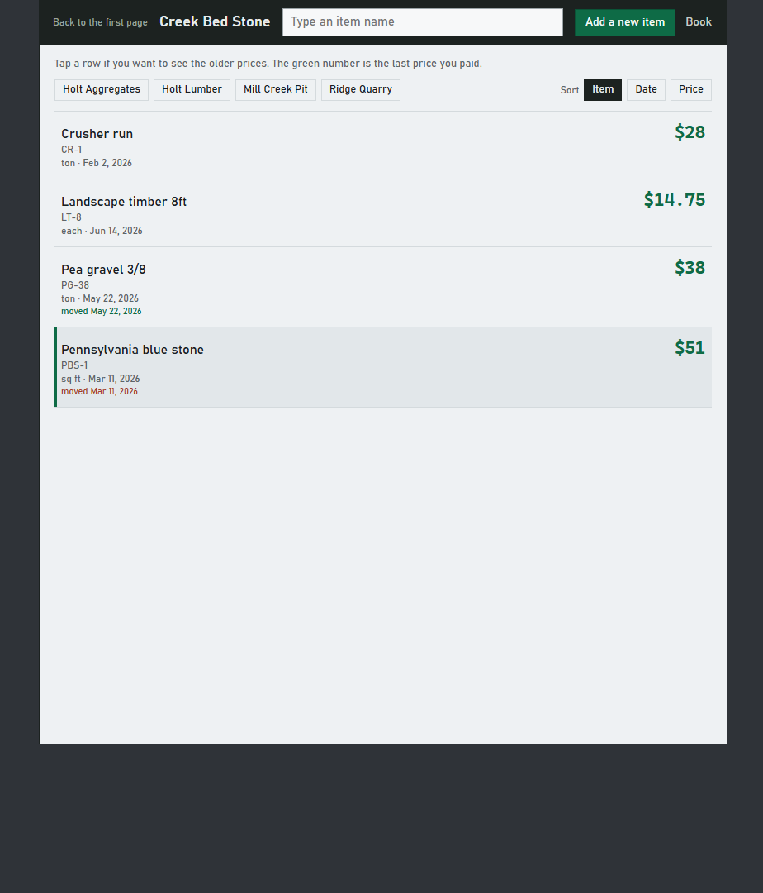
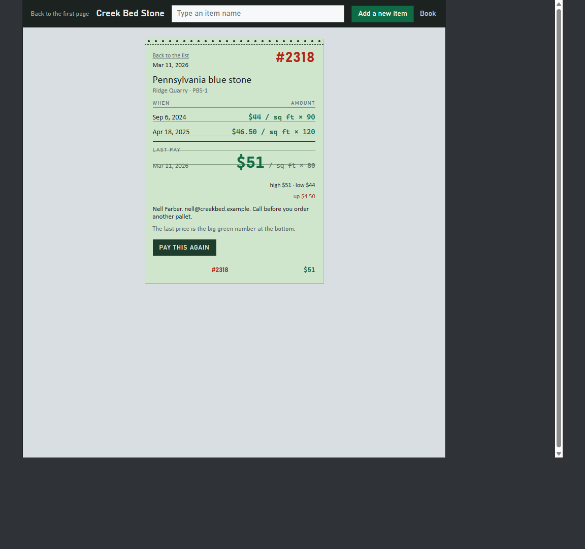
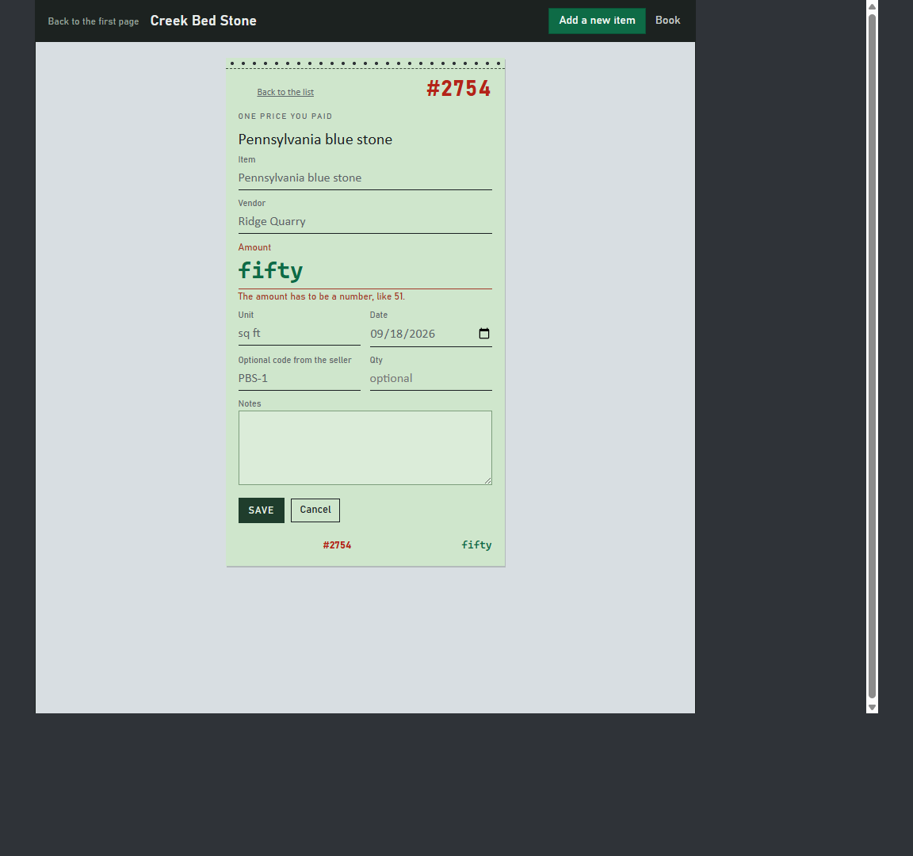

# Last paid

You write down what you paid last time for stone, parts, or
anything you buy twice a year, so next time you can look it up
before you call. The green number is the last price. Click a
row if you want the older prices on a little receipt.

The demo starts on a first page, then you can try a sample shop
or put a name on this computer (optional numbers, not an
account). If you already run React, copy `src/lib/` into your
app and pass `value` and `onChange`. The prices in the demo
stay in the browser.

The sample is Creek Bed Stone. They last paid $51 for
Pennsylvania blue stone. Names are fake. Emails end in
`.example`.

## Who it is for

A shop or yard that already runs React and buys the same stone
or parts twice a year. They want last year's number before they
call again.

## What you get

Copy `src/lib/`. That folder is the component.

- `Workspace.jsx` - the last-price list plus the guest check
- `BuyPage.jsx` - add a price and edit one
- `lastpaid.css` - the look
- `lastpaid-json.js` - last pay, download, load parse
- `sample-buys.js` - Creek Bed Stone sample
- `index.js` - the import

There is no account. Host apps pass `value` and `onChange`. The
demo keeps the book in this browser. Load the sample again if
you want Creek Bed Stone back. Older files with `name` or
`amount` still open.

Find an item. The green number is last pay. Click the row for
the older prices on a guest check. Pay this again prefills.
A blank item or a word in the amount misses. Escape cancels.
Quiet Remove with undo. Print the receipt or the list. j and k
move. Enter opens. n adds. / finds.

## Run the demo

```
npm install
npm start
```

Open http://127.0.0.1:48629/

- `/#/` first page
- `/#/in` name the list on this computer
- `/#/book` the list of prices
- `/#/how` how to use it
- `/#/about` if you already run a React app

Try Creek Bed Stone. Find Pennsylvania blue stone. The green
number is $51. Click the row for the older prices. Add a new
item if it is not on the list. Book saves a copy.

Hosted copy: https://aaronlb912.github.io/lastpaid/

Files: https://github.com/Aaronlb912/lastpaid

## Demo







https://github.com/user-attachments/assets/5c1af282-8993-4936-9ac5-54e5916ad4f6

Repo copy: [docs/media/lastpaid-demo.mp4](docs/media/lastpaid-demo.mp4)

Voice is Microsoft Andrew Neural. Music is Wallpaper by Kevin MacLeod (incompetech.com), CC BY 3.0.

## Copy into your app

Skip the first pages if you already have a React app. Copy
`src/lib/` into your React `src/`.

```
import { useState } from 'react'
import { Workspace, sampleBook } from './lib/index.js'

export function Prices() {
  const [book, setBook] = useState(sampleBook)
  return <Workspace value={book} onChange={setBook} />
}
```

Change the title and the buys. Edit `src/lib/lastpaid.css` if
you want a different look.

`value` is a book: `{ title, buys, sort }`. `sort` is `item`,
`date`, or `price`. A buy is `{ id, item, vendor, unit, price,
date, notes, sku, qty }`. `price` is a number. `qty` is optional.
`date` is YYYY-MM-DD. Pass `onChange` when the book changes. Old
files still load if they use `name` or `amount` instead of `item`
and `price`.
